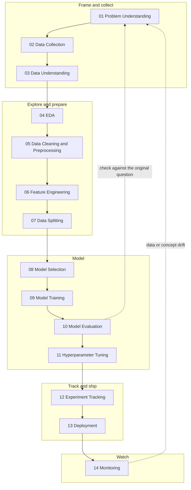
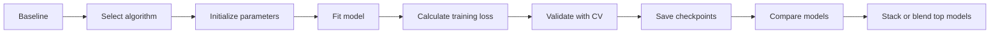

# Data Science Pipeline: Field Notes

A 14-stage Data Science roadmap, from problem understanding to monitoring, with the checks that are easy to skip written into the route.


---

## Overview

This repository documents a Data Science pipeline I researched and structured for my own study and project work. It covers the full route from framing the problem through to monitoring a deployed model, in fourteen stages.

It exists because most learning material treats the model as the centre of a project. In practice the decisions made before training (how the problem is framed, how the data is split) and after deployment (whether the model is still trustworthy) matter just as much. I wanted one page I could follow on any project, and keep on my desk.

**Who it is for:** students and early-career practitioners who want a single structured route through a Data Science project, and anyone who wants a checklist-style reference for the less glamorous stages.

**What it is not:** a library, a framework with code, or a claim that every project needs all fourteen stages. It is a roadmap and a study reference.

---

## The core idea

The roadmap reads as a loop, not a straight line. Three ideas are built into it instead of being left as afterthoughts:

1. **Guard against leakage.** Fit scalers, encoders and imputers on the training set only, then apply them to the test set. The same rule applies to feature selection and target encoding.
2. **Beat a baseline before trusting a model.** Fit a mean prediction (regression) or the majority class (classification) first. The real model has to clearly beat it.
3. **Close the loop.** After evaluation, check the result against the question framed in stage 1. A strong RMSE means nothing if it does not answer the original question. After deployment, drift sends you back to stage 1.

---

## Pipeline architecture



The full-length visual version of the roadmap is in [`docs/assets/ds-pipeline-full.png`](docs/assets/ds-pipeline-full.png). The original print-ready page is in [`source/`](source/).

---

## Stage overview

Everything in this table comes from the original roadmap. Where the roadmap lists tools or methods, they are reproduced as written.

| # | Stage | What the roadmap covers |
|---|---|---|
| 01 | Problem Understanding | Predict a target variable (supervised: regression or classification; no target: unsupervised clustering), explain relationships, find hidden patterns, detect anomalies, build a recommendation, forecast, generate content |
| 02 | Data Collection | Database, CSV, API, sensors, images/video/text/audio, web scraping |
| 03 | Data Understanding | Structured, semi-structured, unstructured data; time series, cross-sectional, panel; numerical and categorical |
| 04 | Exploratory Data Analysis | Missing and duplicate values, outliers, distributions, correlations, class imbalance, target distribution, initial hypothesis, plot types by data kind |
| 05 | Data Cleaning, Preprocessing | Duplicates, missing values (MCAR, MAR, MNAR) and imputation, error and type fixes, outlier handling, text and image preprocessing |
| 06 | Feature Engineering | Encoding or embedding, scaling, normalization, standardization, feature extraction and creation, dimensionality reduction, feature selection |
| 07 | Data Splitting | Train, test, validation; typical ratios; leakage rule; cross-validation for small datasets |
| 08 | Model Selection | Regression, classification, clustering, forecasting, recommendation, NLP, computer vision |
| 09 | Model Training | Baseline first, algorithms by task, and a training flow from baseline through to stacking or blending |
| 10 | Model Evaluation | Metrics by task, visualizations, and the "close the loop" check |
| 11 | Hyperparameter Tuning | Manual, random, grid, Bayesian; Hyperband, Optuna, population-based training for deep learning |
| 12 | Experiment Tracking | Log every run (data version, hyperparameters, metrics) with MLflow, DVC, Weights and Biases |
| 13 | Deployment | Model saving formats, serving APIs, batch and streaming prediction, cloud, Docker, Kubernetes, CI/CD |
| 14 | Monitoring | Error logging, explainability, bias monitoring, data drift, concept drift |

---

## Stage details

### Frame and collect

**01 Problem Understanding.** The stage decides what kind of problem this is. The roadmap lists seven framings: predict a target variable, explain relationships, find hidden patterns, detect anomalies, build a recommendation, forecast the future, and generate content. If there is a target variable the problem is supervised (regression or classification). If there is none it is unsupervised clustering.

**02 Data Collection.** Sources listed: databases, CSV files, APIs, sensors, images/video/text/audio, and web scraping.

**03 Data Understanding.** Classify the data before touching it:
- By structure: structured (Excel, SQL, CSV), semi-structured (JSON, XML, logs), unstructured (image, text, which needs deep learning or embeddings)
- By shape over time: time series, cross-sectional, panel
- By type: numerical, categorical

### Explore and prepare

**04 Exploratory Data Analysis.** Checks for missing values, duplicates, outliers, feature distributions, correlations, class imbalance and target distribution, ending with an initial hypothesis. Class imbalance options listed: sampling, over or undersampling, SMOTE, ADASYN, balanced loss.

| Data kind | Suggested plots |
|---|---|
| Continuous | Histogram, boxplot, density plot, Q-Q plot |
| Categorical | Bar plot, pie chart, frequency table |
| Relationships | Scatterplot, heatmap, pairplot, violin plot |
| Time series | Trend, seasonality, autocorrelation, log plots |

**05 Data Cleaning, Preprocessing.**
- Remove duplicates, correct errors, fix data types, remove inconsistencies
- Missing values are classified as MCAR, MAR or MNAR, then imputed (mean, median, mode, KNN, regression, MICE)
- Outliers handled with IQR, Z-score, DBSCAN or isolation forest
- Text: tokenize, lowercase, remove stopwords, lemmatize
- Images: resize, normalize pixel values, augment

**06 Feature Engineering.** Encoding or embedding, scaling, normalization, standardization, feature extraction and creation, dimensionality reduction (PCA, t-SNE, UMAP) and feature selection (PCA, LASSO, tree-based). Which treatment to apply depends on the model family:

| Case | Guidance |
|---|---|
| Numeric, distance or gradient based (SVM, KNN, PCA, neural nets, logistic regression) | Need StandardScaler or MinMax |
| Tree models (random forest, XGBoost, decision tree) | Need no scaling |
| Categorical, binary | Label encoding |
| Categorical, nominal | One-hot encoding |

**07 Data Splitting.** Train, test and validation sets, with typical ratios of 70 / 15 / 15 or 80 / 20.
- **Leakage rule:** fit scalers, encoders and imputers on the training set only, then apply them to test. Never the reverse. Same rule for feature selection and target encoding.
- **Small dataset:** use k-fold, stratified k-fold, or time series cross-validation instead of a single split.

### Model

**08 Model Selection.** Choose the task family: regression, classification, clustering, forecasting, recommendation, NLP or computer vision.

**09 Model Training.** Start with a baseline: mean prediction for regression, majority class for classification. Algorithms listed by task:

| Task | Algorithms |
|---|---|
| Regression | Linear regression, Ridge, Lasso, SVR, random forest, XGBoost, decision tree, LightGBM, CatBoost |
| Classification | Logistic regression, SVM, KNN, decision tree, random forest, XGBoost, LightGBM, CatBoost |
| Clustering | K-means, DBSCAN, Gaussian mixture |
| Forecasting | ARIMA, Prophet, LSTM |
| NLP | BERT, RoBERTa, GPT, TF-IDF |
| Computer vision | CNN, ResNet, ViT, YOLO |

The training flow, as written in the roadmap:



**10 Model Evaluation.**

| Task | Metrics | Visualize |
|---|---|---|
| Regression | MAE, MSE, RMSE, RMSLE, R squared, adjusted R squared, MAPE | Predicted vs actual, residual plot, error distribution |
| Classification | Confusion matrix, accuracy, precision, recall, specificity, F1, ROC-AUC, MCC, log loss, PR curve | ROC curve, confusion matrix, calibration curve |
| Clustering | Silhouette score, Davies-Bouldin index, Calinski-Harabasz index, inertia | Not specified |
| Forecasting | RMSE, MAE, sMAPE, MASE | Not specified |

**Close the loop:** check the result against the question framed in Problem Understanding.

**11 Hyperparameter Tuning.** Manual search, random search, grid search, Bayesian optimization. For deep learning: Hyperband, Optuna, population-based training.

### Track and ship

**12 Experiment Tracking.** Log every run, including the data version, hyperparameters and metrics. Tools listed: MLflow, DVC, Weights and Biases.

**13 Deployment.**
- Save the model: Pickle, Joblib, ONNX, TorchScript
- Serve it: Flask, FastAPI, Django
- Prediction modes: batch or streaming
- Infrastructure: AWS, Azure, GCP, Docker, Kubernetes, CI/CD

### Watch

**14 Monitoring.** Log errors, explain predictions (SHAP, LIME, permutation importance), monitor for bias, and watch for drift:
- **Data drift:** the input distribution shifts, checked with PSI or the KS test
- **Concept drift:** the relationship between inputs and target shifts, usually the real trigger to retrain

The roadmap ends with an instruction: loop back to stage 01 when the model drifts.

---

## How the stages connect

- **01 drives 08, 09 and 10.** The framing (supervised or not, regression or classification, forecasting, and so on) determines the model family, the algorithms tried and the metrics used.
- **03 drives 05 and 09.** Unstructured data (image, text) needs deep learning or embeddings, and text and images have their own preprocessing steps in stage 05.
- **04 feeds 05.** Missing values, duplicates, outliers and class imbalance found during EDA are what stage 05 handles.
- **06 depends on the model family.** Distance and gradient based models need scaling. Tree models do not.
- **07 constrains 05 and 06.** The leakage rule says fitted transformations are learned from the training set only.
- **09 sets the bar for 10.** The baseline is the benchmark the real model must clearly beat.
- **10 points back to 01.** The evaluation result is checked against the original question.
- **11 and 12 support 09.** Tuning searches for better hyperparameters, and tracking records the data version, hyperparameters and metrics of every run.
- **13 leads to 14.** A deployed model is monitored, and drift sends the work back to stage 01.

---

## Checks built into the roadmap

The roadmap does not define numeric thresholds, and this repository does not add any. The checks it does contain:

| Where | Check |
|---|---|
| 07 Data Splitting | Leakage rule: fit on train only, then apply to test |
| 07 Data Splitting | Small dataset: use k-fold, stratified k-fold or time series cross-validation |
| 09 Model Training | The real model must clearly beat the baseline |
| 10 Model Evaluation | Check the result against the question from stage 01 |
| 12 Experiment Tracking | Every run logs data version, hyperparameters and metrics |
| 14 Monitoring | Data drift (PSI or KS test) and concept drift trigger a return to stage 01 |

---

## Suggested extensions

> **These are not part of the original roadmap.** They are my own review notes, kept separate on purpose. See [`docs/review.md`](docs/review.md) for the longer version.

- **Order of fitted steps.** Stages 05 and 06 come before the split in stage 07, but some of their steps learn from data (imputation, scaling, feature selection, resampling for class imbalance). The leakage rule in stage 07 says these should be fitted on the training set only. Making that explicit in stages 04 to 06 would remove the ambiguity.
- **PCA appears twice in stage 06,** under both dimensionality reduction and feature selection. PCA creates new components, so it fits feature extraction better than selection.
- **Stage 08 overlaps with stages 01 and 09.** The task families are listed in all three places.
- **Tuning is iterative.** Stages 09, 10 and 11 form a loop in practice. The route map draws them as a line.
- **Experiment tracking runs alongside training,** not after tuning. It could be drawn as a cross-cutting concern.
- **Missing from the roadmap:** success criteria and stakeholders in stage 01, formal data validation and schema checks, automated testing, data and model versioning beyond DVC, rollback, and the retraining process itself.

---

## When to use this pipeline

It fits projects where a model will be trained, evaluated and possibly deployed, and where you want a structured route to follow or teach. It is also useful as a study checklist for coursework and portfolio projects.

The full route may be more than you need for a one-off exploratory analysis, a quick descriptive report, or a project that never leaves a notebook. In those cases, stages 12 to 14 can reasonably be skipped.

---

## Limitations

- The roadmap is a list of topics, methods and tools per stage. Inputs, outputs and artifacts for each stage are not specified.
- It is not tied to a specific language or framework, although many of the tools listed are Python-based.
- There is no implementation code in this repository.
- Method and tool choices reflect my research and study, and are not a claim that they are the best option for every project.

---

## Project status

**Conceptual / documentation.** The repository contains a roadmap and study reference. It has no executable code, so there are no install or run commands.

**How to use it:** read the README, open [`source/ds_pipeline_field_notes.html`](source/ds_pipeline_field_notes.html) in a browser for the print-ready roadmap, and follow the stages in order for your own project.

---

## Repository structure

```text
ds-pipeline-field-notes/
├── README.md
├── docs/
│   ├── review.md            # critical review and suggested extensions
│   └── assets/
│       └── ds-pipeline-full.png
└── source/
    └── ds_pipeline_field_notes.html
```

**Planned additions:** one file per stage in `docs/stages/`, per-phase checklists, a glossary (MCAR, PSI, KS test, MICE and so on), a methodology page on the leakage rule, baseline and drift, and the Mermaid source as `diagrams/pipeline.mmd`.

---

## Contributing

Corrections and suggestions are welcome. Open an issue describing the stage and what you would change, or send a pull request with a short explanation. Please keep suggested additions clearly separate from the original roadmap.

---

## License

[NEEDS INPUT] No license has been applied yet. For a documentation-only repository, CC BY 4.0 is a common choice. MIT also works if you plan to add code later.

---

## Author

Tayeb Hossain, Master of Data Science student, Monash University.
[LinkedIn profile URL] · [GitHub profile URL]
